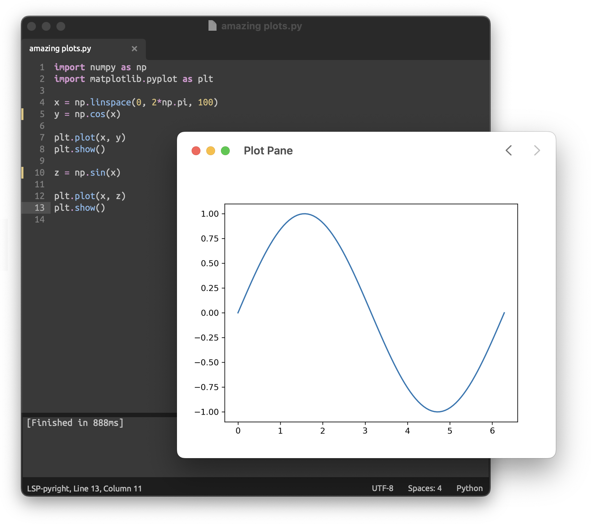

# Plot Pane for Matplotlib (for macOS)

### How to use

First, download the python package from [`Releases`](https://github.com/python-mac/plot-pane/releases) and move it to `$PYTHONPATH`.

Then set `MPLBACKEND="module://plot-pane.backend"` in terminal (not if you are planning to use `jupyter` though) or write `import matplotlib; matplotlib.use("module://plot-pane.backend")` in your python script.

The app will launch each time you `show` the plot in python script. The only advantage is that the app stores previous plots until it's closed (unlike default backend, which displays one plot at a time). The disadvantage is that it's not interactive and uses webview (but because of that it can show gifs).

Technically the app can show any image in base64 format, you just have to open the link in the following form: `plot-pane:<base64 string>`.

### Disclaimer
- This is definitely not a very optimized app, but it serves its purpose.
- The idea of using data in base64 form comes from using [`imgcat` from iTerm2](https://iterm2.com/documentation-images.html), backend script was taken from [imgcat python package](https://pypi.org/project/imgcat/).
- The screenshot shows [Sublime Text](https://www.sublimetext.com), it's not a part of this project
- The theme I'm using is from [Pythonista](https://omz-software.com/pythonista/), it's called `Tomorrow Night`
